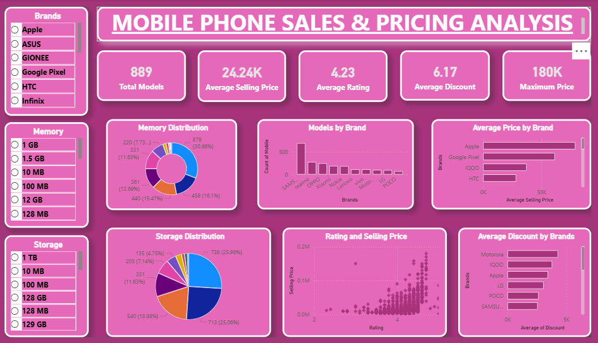

# 📱 Mobile Sales & Performance Analytics Dashboard

<p align="center">
  
  
  
  
</p>

---

## 📌 Table of Contents
* [Overview](#-overview)
* [Key Highlights & Visuals](#-key-highlights--visuals)
* [Dashboard Preview](#-dashboard-preview)
* [Core Interactive Features](#-core-interactive-features)
* [Repository Structure & Pipeline](#-repository-structure--pipeline)
* [How to Access & Run](#-how-to-access--run)
* [Future Roadmap](#-future-roadmap)

---

## 🔎 Overview
An end-to-end data analysis and business intelligence project exploring smartphone sales volume, revenue drivers, brand market share, and regional retail performance. 

> [!NOTE]
> Includes exploratory data analysis (EDA) conducted via Python and interactive visual reporting built in Power BI Desktop.

---

## 💡 Key Highlights & Visuals

* **Brand & Model Share:** Sales distribution across leading smartphone brands and handset models.
* **Price Point & Tier Segmentation:** Revenue contribution across budget, mid-range, and flagship price tiers.
* **Regional & Channel Trends:** Geographical volume trends and distribution channel efficiency.
* **Monthly/Quarterly Variance:** Period-over-period growth trajectories and seasonality spikes.

---

## 🖥️ Dashboard Preview

<p align="center">
  
</p>

---

## ⚡ Core Interactive Features

* **Dynamic Brand Slicers:** Filter the entire report canvas by smartphone brand, series, or OS.
* **Timeline Controls:** Drill down through yearly, quarterly, and monthly sales performance.
* **Cross-Visual Filtering:** Click any brand or tier bar to dynamically update all revenue cards and profit margins.
* **Hover Tooltips:** Inspect exact unit sales, ASP (Average Selling Price), and discount percentages on mouseover.

---

## 🗂️ Repository Structure & Pipeline

<details>
<summary><b>Click to expand file breakdown & methodology</b></summary>

<br>

### 📁 Project Files
* **`Mobile data.csv`**: Raw dataset containing transactional sales data, pricing, specs, and geographic details.
* **`Mobile_Sales_Project.ipynb`**: Jupyter Notebook containing data cleaning, missing value handling, outlier detection, and statistical summaries.
* **`Mobile_Sales_Project.pbix`**: Interactive Power BI workbook featuring custom DAX measures, data modeling, and reporting views.
* **`Mobile_Sales_Anaysis.png`**: High-resolution dashboard snapshot for quick preview.

### ⚙️ Analytical Workflow
1. **Data Prep & Cleaning:** Handled missing values, formatted currency and dates, and removed redundant records using Python (`pandas`).
2. **Data Modeling:** Loaded cleaned tables into Power BI and established relational star/snowflake schemas.
3. **DAX Measures:** Calculated key business indicators including Total Units Sold, Gross Margin %, and Average Selling Price.

</details>

---

## 🚀 How to Access & Run

1. **Clone the Repository:**
   ```bash
   git clone [https://github.com/rohitpatil261003/Mobile_Sales_Project.git](https://github.com/rohitpatil261003/Mobile_Sales_Project.git)
